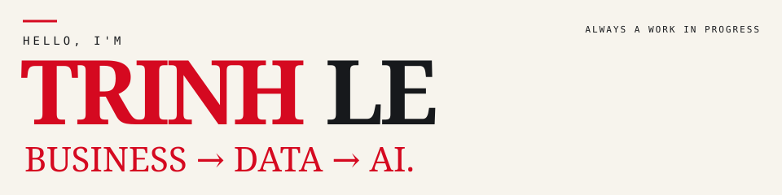
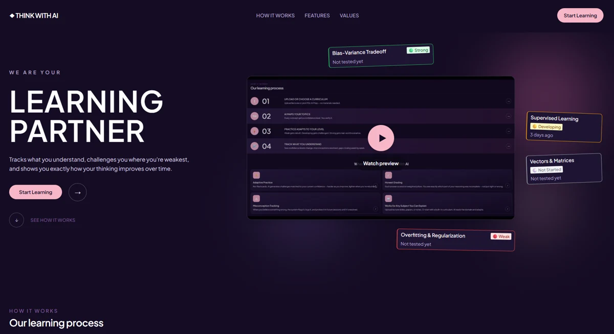
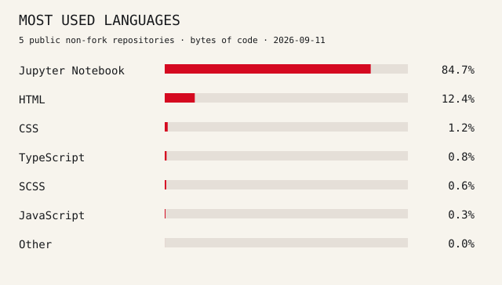

**MSc Artificial Intelligence @ University of Stirling, UK** 
ASEAN-UK SAGE Women in STEM Scholar 2026/27

**Shopee · Unilever · CJ Foods · Avery Dennison · ITL** 
Experience across e-commerce, FMCG, manufacturing & supply chain

**Instructor · Data Analysis & Data Science @ CoderSchool**

[**PORTFOLIO ↗**](https://lengocphuongtrinh.github.io/) &nbsp; / &nbsp; [**LINKEDIN ↗**](https://www.linkedin.com/in/kayleetrinh99/) &nbsp; / &nbsp; [**EMAIL ↗**](mailto:lnpt.work@gmail.com)

 

## 02 / My journey

### Same curiosity. A bigger canvas.

 Vietnam → Business → Data → AI →  UK → **?**

 

## 03 / Exploring + Building

Exploring AI projects that can create meaningful impact across society and industry.

**01 / FEATURED PROJECT**

### Think With AI · Learning Partner

**Understand Deeper. Not Just Faster.**

An adaptive AI learning experience designed to help learners engage more deeply with concepts rather than simply receive faster answers.

`AI` · `Education` · `Personalization`

[**EXPLORE PROJECT ↗**](https://think-with-ai.vercel.app/)

---

**02 / [OEE Manufacturing ↗](https://github.com/LeNgocPhuongTrinh/dashboard-visualization/tree/7a2c1d8808f39043f4e89bb051f2d37d8f507f27/OEE%20Manufacturing)** 
Trace availability, performance, and quality losses from the plant overview to individual machines. 
`Power BI` · `Data Visualization`

**03 / [Material Requirement Planning ↗](https://github.com/LeNgocPhuongTrinh/python/tree/d80c5a6387380d7ec6ffe036a684d9f324bd0680/Supply%20Planning)** 
Calculate planned order releases with shelf life, minimum order quantities, and materials held across multiple sites. 
`Python` · `Supply Chain`

## 04 / Skills, in practice.

Actual byte counts from GitHub’s languages API · Public non-fork repositories · [Source data & snapshot date](assets/languages.json)

**CODE & DATA** 
Python · SQL ·  VBA · HTML · CSS · JavaScript · TypeScript

**ANALYTICS & AI** 
Statistical Analysis · A/B Testing · Data Visualization · Simulation · Forecasting · Machine Learning

**PLATFORMS & BUILDING** 
Azure Cloud · Microsoft Power Platform · Power BI · Power Query · Power Apps · Power Automate · Figma

**PRODUCT & DELIVERY** 
Data-driven Decision Making · Stakeholder Management · Product Management · BPMN · Project Management

**GITHUB ACTIVITY** 
[View my live contribution calendar and recent activity ↗](https://github.com/LeNgocPhuongTrinh#overview)

---

## 05 / Learn. Build. Contribute.

**STILL EXPLORING →**

[**PORTFOLIO ↗**](https://lengocphuongtrinh.github.io/) &nbsp; / &nbsp; [**LINKEDIN ↗**](https://www.linkedin.com/in/kayleetrinh99/) &nbsp; / &nbsp; [**EMAIL ↗**](mailto:lnpt.work@gmail.com)

 

